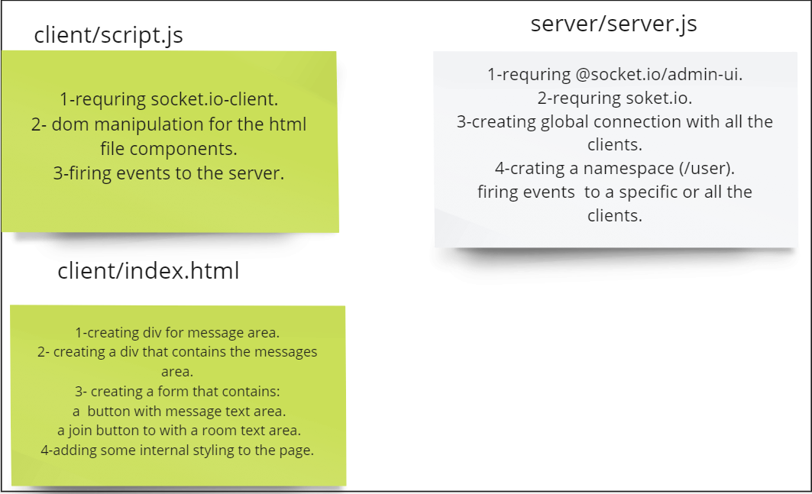

# Socket.io-Lab-Class12
 chat Rooms project.

# summary :
### For today's task all what i did so far:
* Createed an html flie that contains  a form which sends messages from the client(user) and joins to a room .
* creating socket.io connection .
* firing events from the client th the server Also from the server to the clients. 

# UML :

